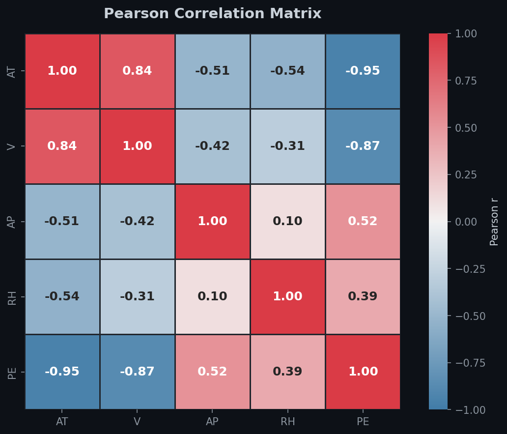
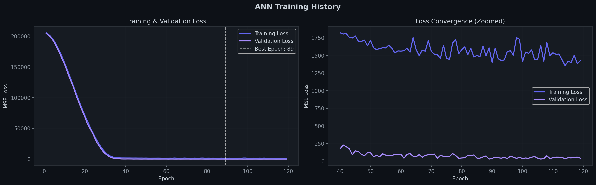
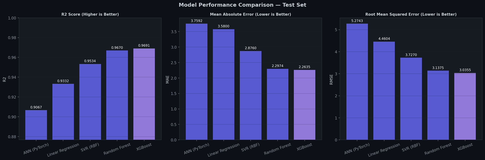
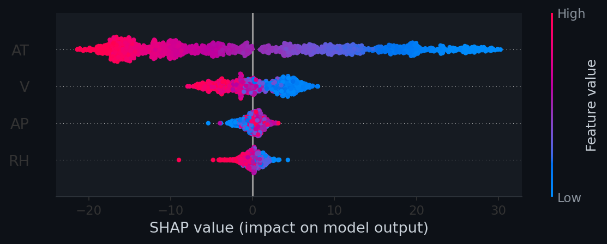

# Power Plant Energy Prediction


**Live Demo:** [https://power-plant-energy-prediction.streamlit.app/](https://power-plant-energy-prediction.streamlit.app/)

A comprehensive end-to-end Deep Learning regression project. This repository contains the data pipeline, an Artificial Neural Network (built with PyTorch), classical machine learning models for comparison, and an interactive web dashboard for real-time inference.

## Overview

The goal of this project is to predict the net hourly electrical energy output (PE) of a Combined Cycle Power Plant (CCPP) based on four key ambient variables measured by sensors:

- Temperature (AT) in degrees Celsius
- Exhaust Vacuum (V) in cmHg
- Ambient Pressure (AP) in millibar
- Relative Humidity (RH) as a percentage

This solution demonstrates a full machine learning lifecycle, from exploratory data analysis to model building, architectural optimization, and production deployment using Streamlit.

**Author:** Kabir Patil  
**Portfolio:** [GitHub](https://github.com/kabirpatil12676)

---

## Screenshots

| EDA & Correlation | Training Curves |
|---|---|
|  |  |

| Model Comparison | SHAP Explainability |
|---|---|
|  |  |

---

## Features

- **Deep Learning Pipeline**: A custom-architected Artificial Neural Network (ANN) using PyTorch, featuring Batch Normalization, Dropout regularization, and the Adam optimizer with a learning rate scheduler (ReduceLROnPlateau).
- **Model Comparison**: Evaluation of the PyTorch ANN against classical machine learning algorithms, including Random Forest, Support Vector Regression (SVR), and XGBoost.
- **Explainability**: SHAP value analysis (TreeExplainer) for XGBoost model interpretability with beeswarm, bar, and waterfall plots.
- **Interactive Dashboard**: A modern, dark-themed Streamlit application that allows users to adjust ambient feature inputs in real-time and view the predictive output. The dashboard also includes thorough data visualizations (correlation matrices, distributions, residual analytics) powered by Plotly.
- **Clean Architecture**: Modular code separation for modeling, training, and the web application.

## Directory Structure

```text
.
├── app.py                   # Main Streamlit web application
├── train.py                 # Training script for the PyTorch ANN and ML models
├── ANN_Regression.ipynb     # Jupyter Notebook detailing the full data science workflow
├── requirements.txt         # Dependencies required to run the project
├── powerplant_data.csv      # Dataset (UCI CCPP)
├── assets/                  # Static visualisation assets used in README
│   ├── eda_correlation.png
│   ├── training_curves.png
│   ├── model_comparison.png
│   └── shap_beeswarm.png    # (and more)
└── models/                  # Checkpoints, metadata, and data scalers (generated after training)
    ├── best_ann_model.pt
    ├── metadata.json
    └── scaler.pkl
```

## Setup and Installation

**1. Clone the repository**
```bash
git clone https://github.com/kabirpatil12676/Power-Plant-Energy-Prediction.git
cd Power-Plant-Energy-Prediction
```

**2. Create a virtual environment (optional but recommended)**
```bash
python -m venv venv
source venv/bin/activate  # On Windows use: venv\Scripts\activate
```

**3. Install dependencies**
```bash
pip install -r requirements.txt
```
*Note: Make sure your environment supports all necessary packages including: torch, streamlit, plotly, xgboost, shap, scikit-learn, joblib, pandas, numpy, matplotlib, seaborn.*

## Usage

**1. Train the Models**
To compile the model architecture, run the data through the training pipeline, and output the necessary artifacts to the `models/` directory, run:
```bash
python train.py
```
This script handles data scaling, PyTorch DataLoader construction, training/validation loops, early stopping, and generates the necessary serialization artifacts.

**2. Launch the Application**
To start the interactive Streamlit dashboard:
```bash
streamlit run app.py
```
Open the provided `localhost` URL in your web browser to interact with the application.

## Model Performance

The solution evaluates the mean continuous output on out-of-sample test datasets. Extreme Gradient Boosting (XGBoost) forms the strongest predictive baseline, significantly outperforming linear benchmarks:

| Model | R² Score | RMSE | MAPE |
|---|---|---|---|
| **XGBoost** | **0.969** | **3.04 MW** | **0.50%** |
| Random Forest | 0.967 | 3.14 MW | 0.51% |
| SVR (RBF) | 0.953 | 3.73 MW | 0.63% |
| Linear Regression | 0.933 | 4.46 MW | 0.79% |
| ANN (PyTorch) | 0.907 | 5.27 MW | 0.83% |

With an average Root Mean Squared Error of ~3 MW on an average net output of ~454 MW, the top models exhibit **less than 1% relative margin of error** — suitable for real-world grid scheduling.

> **Note on ANN vs. Linear Regression:** The ANN (R²=0.91) underperforms Linear Regression (R²=0.93) on this dataset. This is expected and insightful: the dataset has only 4 features with strong linear correlations. Tree-based models and linear methods inherently exploit low-dimensional tabular structure more efficiently than deep ANNs, which show diminishing returns without larger, more complex feature spaces.

## Dataset Acknowledgement

The dataset was sourced from the UCI Machine Learning Repository. It contains 9,568 hourly average ambient environmental readings from a Combined Cycle Power Plant operating between 2006 and 2011.

**Reference:**  
P. Tufekci, "Prediction of full load electrical power output of a base load operated combined cycle power plant using machine learning methods," *International Journal of Electrical Power & Energy Systems*, 2014.

## License

This project is licensed under the MIT License — see the [LICENSE](LICENSE) file for details.
